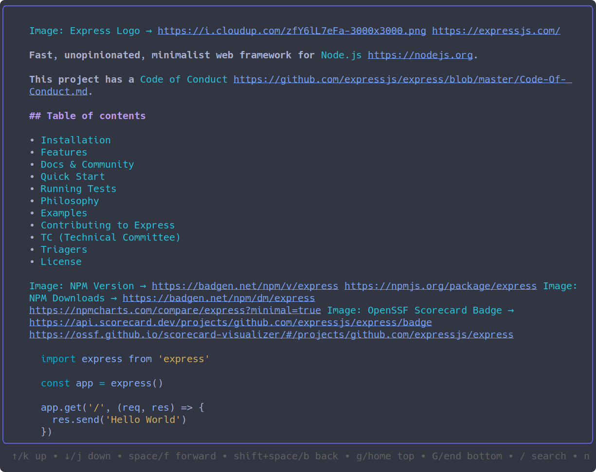

# miru

> **Warning**
> This project is in early development (pre-0.1.0) and the API is not stable.
> Breaking changes may occur without notice.
> Use with caution.

A command-line tool for viewing package documentation with a man-like interface.



## Features

- View package documentation in terminal with man-like interface
- Support for multiple package registries and documentation sources
- Open documentation in browser
- Search packages and their documentation
- Configurable browser integration
- [ ] View structured documentation
  - Show documentation from symbols, types, and functions

## Screencast

https://github.com/user-attachments/assets/8cbf0e44-3aea-42b7-ad40-0e95340d17db

## Installation

### Go Install

```bash
go install github.com/ka2n/miru/cmd/miru@latest
```

### Package Installation

#### macOS

For macOS users, miru is available via Homebrew:

```bash
# Add the tap repository
brew tap ka2n/tap

# Install miru
brew install miru
```

#### Arch Linux

For Arch Linux users, miru is available in the AUR as `miru-go-bin`:

```bash
yay -S miru-go-bin
```

#### Alpine Linux

```bash
MIRU_VERSION=X.X.X
# Download the package
wget https://github.com/ka2n/miru/releases/download/v${MIRU_VERSION}/miru_${MIRU_VERSION}-1_amd64.apk

# Install the package
apk add --allow-untrusted ./miru_$MIRU_VERSION-1_amd64.apk
```

#### Debian/Ubuntu

```bash
MIRU_VERSION=X.X.X
# Download the package
wget https://github.com/ka2n/miru/releases/download/v${MIRU_VERSION}/miru_${MIRU_VERSION}-1_amd64.deb

# Install the package
apt install ./miru_$MIRU_VERSION-1_amd64.deb
```

#### RHEL/Rocky Linux

```bash
MIRU_VERSION=X.X.X
# Download the package
wget https://github.com/ka2n/miru/releases/download/v${MIRU_VERSION}/miru_$MIRU_VERSION-1_amd64.rpm

# Install the package
rpm -i miru_$MIRU_VERSION-1_amd64.rpm
```

## Usage

### CLI

View package documentation in terminal:

```bash
miru [package]                    # Display documentation in man-like interface
miru [package] -b                 # Open documentation in browser
miru [lang] [package]             # Specify package language explicitly
miru [package] --lang [lang]      # Specify package language with flag
miru [package] -o json           # Output metadata in JSON format
```

Examples:

```bash
# View package documentation
miru github.com/spf13/cobra

# Open documentation in browser
miru golang.org/x/sync -b

# Specify language explicitly
miru go github.com/spf13/cobra

# Specify language with flag
miru github.com/spf13/cobra --lang go

# Output package metadata in JSON format
miru github.com/spf13/cobra -o json
```

### MCP Server

```
miru mcp
```

#### Tools

- **fetch_library_urls** Fetch library related URLs from repository or registry.
- **fetch_library_docs** Fetch library documentation content and other links from repository or registry.


## Configuration

Browser integration can be configured through environment variables:

```bash
MIRU_BROWSER=firefox                # Specify browser to use
MIRU_BROWSER_PATH=/path/to/browser  # Specify browser binary path
MIRU_NO_CACHE=1                     # Disable caching
MIRU_GH_BIN=/usr/bin/gh             # Path to GitHub CLI
MIRU_GLAB_BIN=/usr/bin/glab         # Path to GitLab CLI
MIRU_PAGER_STYLE=auto               # pager style: auto, dark, dracula, light, notty, pink, tokyo-night see https://github.com/charmbracelet/glamour/tree/master/styles/gallery
MIRU_DEBUG=1                        # Enable debug output
```

By default, miru uses [github.com/pkg/browser](https://github.com/pkg/browser) for browser integration.

## Documentation Sources

miru supports fetching documentation from:

- pkg.go.dev
- npmjs.com
- crates.io
- rubygems.org
- jsr.io
- pipy.org
- github.com
- gitlab.com

## Development
### Package Structure

```
github.com/ka2n/miru/
├── api/      # Core implementations for documentation fetching and rendering
├── cli/      # CLI interface implementation
├── mcp/      # Model Context Protocol server implementation
└── cmd/miru/ # Main command implementation
```


### Requirements

- Go 1.21 or later

### Setup

1. Clone the repository

```bash
git clone https://github.com/ka2n/miru.git
cd miru
```

2. Build

```bash
go build ./cmd/miru
```

3. Run tests

```bash
go test ./...
```

## Contributing

Contributions are welcome! Please feel free to submit a Pull Request.

## License

MIT License - see [LICENSE](LICENSE) for details
